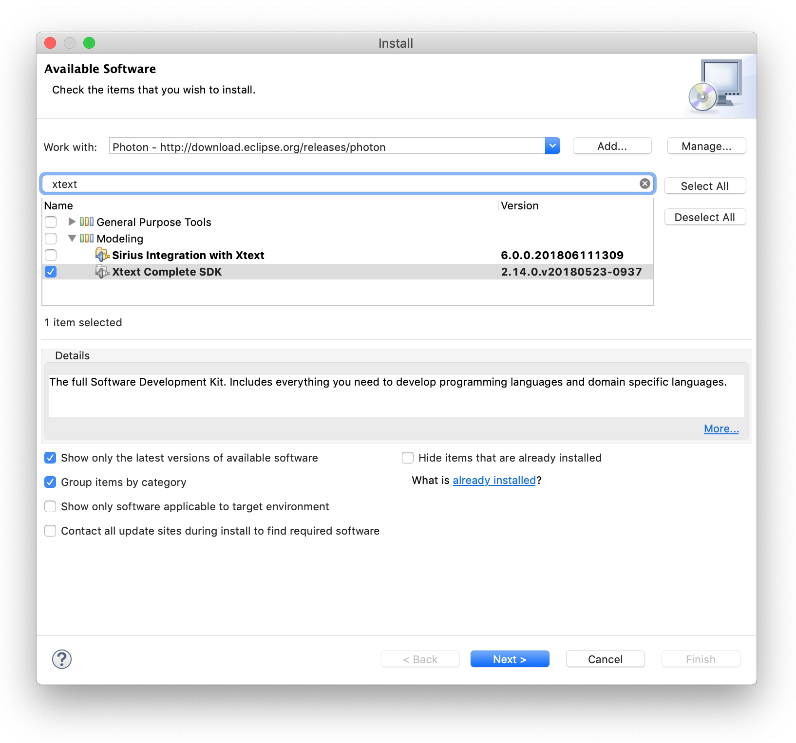

## University of York Model-Driven Engineering (MODE) lecture on *Textual Modelling with Xtext*

This repository contains instructions on how to install Eclipse and Xtext as well as how to create a new Xtext project. Moreover, it contains the source code of two exemplary domain-specific modeling languages implemented with the Eclipse Xtext language workbench: *Entity DSL* and *State Machine DSL*.

---------

### How to install Eclipse and Xtext:

First, download Eclipse Epsilon distribution from the [Eclipse Epsilon website](http://www.eclipse.org/epsilon/download/) and follow the installation instructions.

Secondly, once Eclipse is installed, the Xtext framework needs to be installed through the *Install New Software...* dialog. Select the Eclipse Photon repository at the *Work with:* drop-down menu and type "xtext" in the search field. Finally, select the checkbox for "Xtext Complete SDK", click *Next >*, accept the terms, and select *Finish* to complete the installation (Eclipse restart required).

### How to import an existing Xtext projects:

First, right-click in the *Package Explorer* view and select *Import...*.

Secondly, select *Existing Projects into Workspace*.

Then, use the *Browse...* button located on the right-hand side of the *Select root directory:* text-field to choose the location of your Xtext projects. Finally, click *Finish* to import the projects into your workspace.

### How to run your Xtext DSL editor:

First, a launch configuration needs to be created to launch an *Eclipse Application*.

Secondly, make sure that enabled plugins do not cause validation problems by selecting the *plug-ins* tab and clicking *Validate Plug-ins*. In case you encounter validation problems, select *plugins selected below only* in the *Launch with:* drop-down menu followed by de-selecting plug-ins that cause validation problems.

Next, run the created launch-configuration (a new Eclipse instance will start) and create a new (empty) project by using the Eclipse creation wizard. Finally, create a new (empty) file inside the created project that exactly matches the file-extension that your Xtext DSL specifies. If you are unsure about the file extension that your Xtext DSL defines, take a look at the *fileExtensions* attribute value in the *.mwe2 file.

To check if the dedicated editor for your Xtext DSL has been loaded properly, press *CTRL + Space* on your keyboard to open content-assist window. If it has been loaded correctly, it will suggest content that appears in the definition of your DSL.

### How to create a new Xtext project (in general):

Once Xtext is installed (a restart of Eclipse is required), the Eclipse creation wizard will show two entries for Xtext: *Xtext Project* and *Xtext Project From Existing Ecore Models*.

### How to create a new Xtext project from an existing Ecore model:

Use the Eclipse wizard to create a *Xtext Project From Existing Ecore Models*.

Use the *Add* button to add the *.genmodel of your DSL to the wizard for selection.

Select the *Entry Rule* for your grammar and finalize the wizard by clicking the *Finish* button. As a result, you will see a set of new projects appearing the in *Package Explorer*. If the project that contains the *.xtext file, i.e. the grammar of your DSL, appears as erroneous, right-click on your *.ecore file and select *Register EPackages*; if any change is made to the *.xtext file that allows it to be saved, the errors will disappear (try adding an empty line at the bottom and saving the file).

At this point in time you may edit your grammar and once you are satisfied with its state, you can trigger the MWE2 workflow to auto-generate the components of your DSL by right-clicking on the *.mwe2 file and selecting *Run As > MWE2 Workflow* and finally launch your editor as described above (see *How to run your Xtext DSL editor).

### Further resources:

 - [Xtext documentation and tutorials](https://www.eclipse.org/Xtext/documentation)

- [Xtext scoping documentation](https://www.eclipse.org/Xtext/documentation/Scoping)

- [Xtext Scoping documentation](https://www.eclipse.org/Xtext/documentation/303_runtime_concepts.html#scoping)

- [Xtext Declarative Scope Provider documentation](http://download.eclipse.org/modeling/tmf/xtext/javadoc/2.3/org/eclipse/xtext/scoping/impl/AbstractDeclarativeScopeProvider.html)
